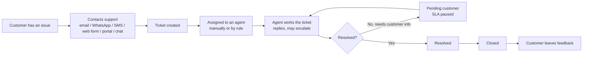
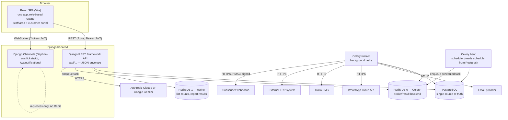
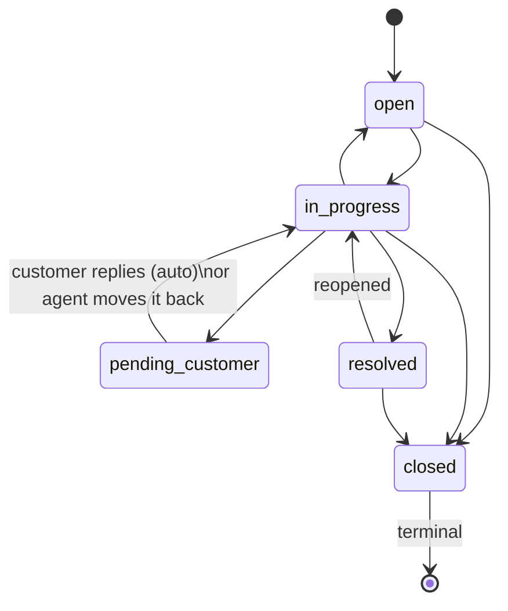
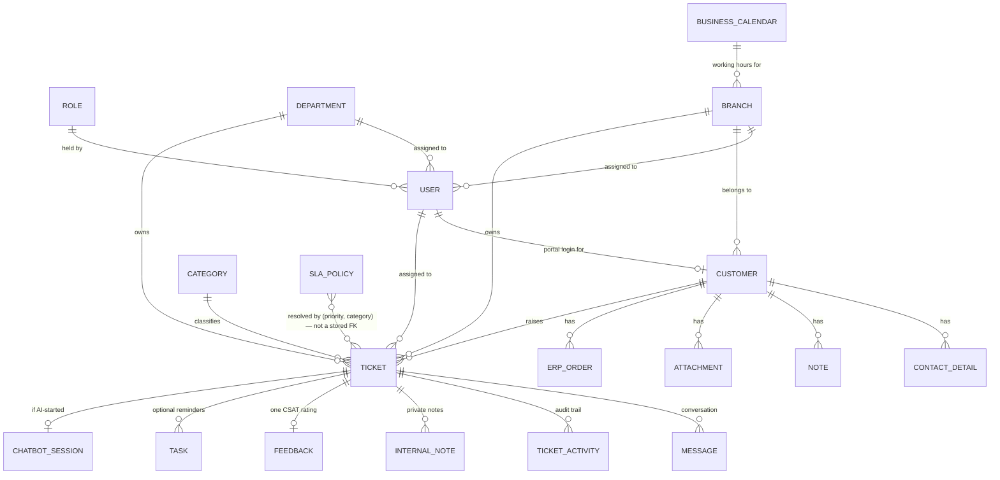
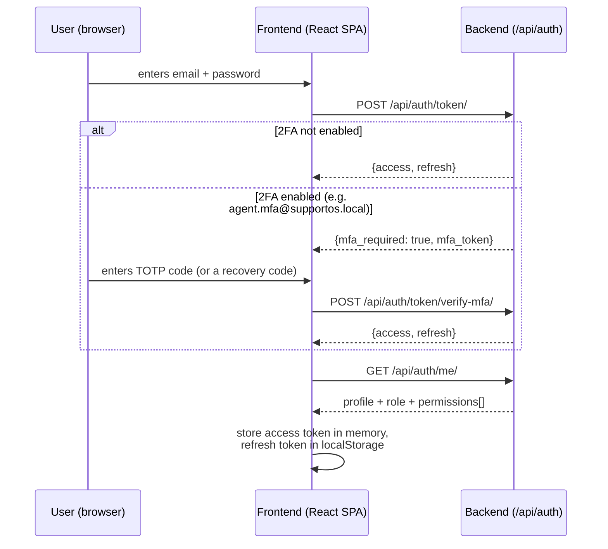
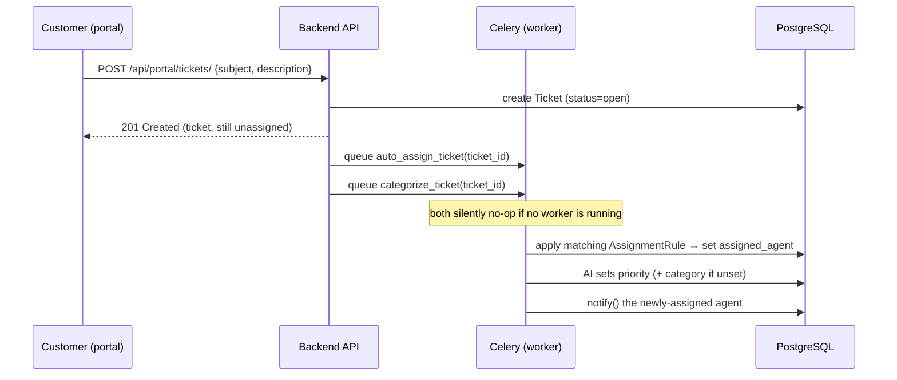

# SupportOS — How To Use This Project

A complete guide for a new developer or QA engineer who has never seen this codebase or this
business before. It covers what the system does, how to run it, who the test users are, how the
business actually works, and how to test the full cycle end to end.

> This file is business/testing-focused. For exact technical setup commands, environment variable
> reference, and API conventions, [`README.md`](README.md) is the authoritative source — this guide
> cross-references it rather than duplicating it, except where copy-paste convenience matters.
> [`CONVENTIONS.md`](CONVENTIONS.md) is the authoritative source for internal coding conventions.

## Table of Contents

1. [Project Overview](#1-project-overview)
2. [Architecture Overview](#2-architecture-overview)
3. [Prerequisites](#3-prerequisites)
4. [Installation & Setup](#4-installation--setup)
5. [Environment Variables](#5-environment-variables)
6. [Test Users](#6-test-users)
7. [Business Concepts](#7-business-concepts)
8. [Complete Business Cycle](#8-complete-business-cycle)
9. [End-to-End Testing Scenarios](#9-end-to-end-testing-scenarios)
10. [Role & Permission Matrix](#10-role--permission-matrix)
11. [Status & State Transitions](#11-status--state-transitions)
12. [API Guide](#12-api-guide)
13. [Database / Data Relationships](#13-database--data-relationships)
14. [Troubleshooting](#14-troubleshooting)
15. [Reset & Re-seed Test Data](#15-reset--re-seed-test-data)
16. [Quick Start](#16-5-minute-quick-start)
17. [Business Flow Diagrams](#17-business-flow-diagrams)
18. [Testing Checklist](#18-testing-checklist)
19. [What I Need to Know Before Testing](#19-what-i-need-to-know-before-testing)

---

## 16. 5-Minute Quick Start

*(Numbered last in the outline above, but you'll want it first — jump here to get moving.)*

```powershell
# 1. Backend
cd backend
python -m venv .venv
.\.venv\Scripts\Activate.ps1
pip install -r requirements.txt
Copy-Item .env.example .env
# edit backend/.env: set DJANGO_SECRET_KEY and POSTGRES_PASSWORD (see § 4)
python manage.py migrate

# 2. Seed realistic test data (users, customers, tickets, SLA config — see § 6)
python manage.py seed_demo_data

# 3. Start the backend
python manage.py runserver

# 4. Frontend (new terminal)
cd frontend
npm install
Copy-Item .env.example .env
npm run dev
```

5. Open <http://localhost:5173/login> and sign in as **`agent.omar@supportos.local`** / **`Passw0rd!2026`**.
6. Follow [§ 8 Complete Business Cycle](#8-complete-business-cycle) or the [Happy Path](#happy-path) in § 9.

**Note:** Celery (worker + beat) and Redis are not required to click through the main ticket flow,
but background features silently do nothing without them: SLA escalation, ticket
auto-assignment, email/notification delivery, AI features, ERP sync, and outbound webhooks. See
[README § 6](README.md#6-run-celery-sla-0) to start them, and § 2 below for why.

---

## 1. Project Overview

### What the system does

SupportOS is a **customer support / helpdesk platform** — the kind of system a company uses to
receive, track, and resolve customer support requests ("tickets") across multiple communication
channels (email, WhatsApp, SMS, live chat, a public web form), with SLA tracking, a knowledge base,
an AI assistant, and reporting.

### What business problem it solves

Without a system like this, a support team juggles individual emails/chats with no shared record of
who's handling what, no visibility into response-time commitments, and no way to see a customer's
full history. SupportOS solves that by giving every customer interaction one shared home (a
**Ticket**), routing and tracking it through a defined lifecycle, measuring it against **SLA**
(Service Level Agreement) time targets, and letting a customer self-serve through a knowledge base
or portal before ever needing a human.

### Who uses the system

- **Support agents** — handle tickets day to day: reply, reassign, escalate, resolve.
- **Support managers** — oversee the team: reports, escalated-ticket visibility, staff management.
- **Administrators** — configure the system: roles, integrations, SLA policies, org settings.
- **Customers** — the people raising issues, either through a self-service **customer portal**, or
  through email/WhatsApp/SMS/live chat/a public web form (no login required for those channels).

### Main user types / roles

| Role (`Role.slug`) | Who | One-line description |
|---|---|---|
| `super_admin` | Administrator | Full internal configuration access — users, roles, integrations, settings |
| `manager` | Support manager | Oversees agents, sees reports, manages customers/tickets, cannot manage users/roles/settings |
| `agent` | Support agent | Handles the day-to-day ticket queue: customers + tickets, read-only knowledge base |
| `customer` | End customer | Portal-only: their own tickets, FAQs/articles, submit feedback |

There is also a fifth possibility worth knowing about explicitly: a Django **superuser** account
(`is_superuser=True`, e.g. the account you create with `createsuperuser`). It bypasses the role
system entirely and is granted *every* permission in the system, including two that no seeded role
actually holds today (see the flagged inconsistency in [§ 10](#10-role--permission-matrix)).

### High-level business workflow



Every step above is measured against an **SLA policy** (a time target for first response and for
resolution, based on the ticket's priority and category), and every status change, assignment
change, and merge is written to an immutable **activity log** you can review on the ticket.

---

## 2. Architecture Overview

### Components



- **Frontend**: React 19 + Vite + TypeScript + Tailwind v4 + shadcn/ui + TanStack Query (server
  state) + React Hook Form + Zod (forms/validation) + Axios (HTTP) + i18next (English/Arabic, RTL).
  One single-page app — **not** two separate apps — split by role-based routing: a staff/admin route
  tree and a customer-portal route tree are siblings under one router, both gated by login and
  by permission checks.
- **Backend**: Django 5.2 + Django REST Framework, organized as one Django app per business domain
  (`accounts`, `customers`, `tickets`, `sla`, `communications`, `agents`, `notifications`,
  `organization`, `knowledge_base`, `portal`, `reports`, `integrations`, `ai`, `compliance`, `core`).
- **Database**: **PostgreSQL only** — no SQLite fallback. It is the single source of truth for
  everything: users, roles, customers, tickets, messages, SLA config, audit log, everything.
- **Authentication/authorization**: JWT access + refresh tokens
  (`djangorestframework-simplejwt`), with an optional TOTP-based 2FA step. Authorization is
  **role-based**: a `Role` row holds a list of permission strings; a user holds one `Role` (or none,
  if they're a Django superuser). See [§ 10](#10-role--permission-matrix).
- **External services/integrations**: an ERP system (customer/order sync, one-way for orders), an
  email provider (SMTP), WhatsApp Business Cloud API, Twilio SMS, outbound webhooks to any
  subscriber URL, and an AI provider (Anthropic Claude or Google Gemini — selected by one setting,
  not "whichever key is present") for ticket summarization, reply suggestions, auto-categorization,
  and the customer-facing chatbot.
- **Background jobs**: Celery, with `django-celery-beat` for anything on a schedule (stored in
  Postgres, editable from `/admin/`). See the task table in [§ 2.1](#21-background-jobsscheduled-tasks) below.
- **APIs**: one REST API tree under `/api/...`, self-documented via `/api/schema/`, `/api/docs/`
  (Swagger UI), `/api/redoc/`. See [§ 12](#12-api-guide).
- **Message queue / cache**: **Redis, used for two unrelated purposes on two different logical
  databases** — DB 0 is the Celery broker/result backend (must never be flushed), DB 1 is the
  Django cache (safe to flush, costs latency not correctness if lost). This split is deliberate, not
  incidental — see `README.md`'s Performance & caching section.

### Request/data flow

1. The browser calls the API with `Authorization: Bearer <access token>` (staff/customer login) —
   or, for a handful of public endpoints (web form, live chat start, inbound provider webhooks), with
   no auth at all.
2. Django resolves the caller's permissions (`role.permissions`, or "everything" for a true
   superuser) and enforces them per-endpoint (`HasPermission`, reading each view's own
   `permission_map`).
3. Every response — success or error — is wrapped in the same 4-key JSON envelope:
   `{success, data, error, meta}`. See [§ 12.4](#124-error-format).
4. A write that needs something to happen *later or elsewhere* (an outbound email, an AI call, a
   webhook delivery, auto-assignment) **queues a Celery task** rather than doing it inline — the API
   response returns immediately, and the work happens in the `worker` process. If no worker is
   running, the queued task simply never executes — no error is shown anywhere. This is the single
   most common "why isn't X happening" surprise for a new developer; see
   [§ 14 Troubleshooting](#14-troubleshooting).
5. Two features stay live over **WebSockets** instead of polling: the ticket chat panel and the
   notification bell. Both are receive-only pushes, authenticated via a `?token=` query-string JWT
   (browsers can't set custom headers on a WS handshake).
6. `django-celery-beat`'s **beat** process wakes on its own schedule (stored in Postgres, not code)
   and enqueues the same kind of Celery tasks onto the same broker — it never talks to the API.

### 2.1 Background jobs/scheduled tasks

| Task | Runs | What it does |
|---|---|---|
| `evaluate_escalations` | every 5 minutes | Escalates open, not-yet-escalated tickets that are at-risk of an SLA breach or idle, per enabled `EscalationRule` |
| `send_due_task_reminders` | every 5 minutes | Notifies an agent once one of their `Task` reminders is overdue |
| `run_erp_sync` | every 1 hour | Imports ERP customers/orders (or exports customers) — inert until `/settings/erp` is configured |
| `run_data_retention` | daily at 02:00 | Anonymizes/purges old closed tickets, messages, attachments, audit log entries per `OrganizationSettings` — each of the four is independently opt-in |
| `auto_assign_ticket` | on ticket creation | Applies the matching `AssignmentRule` (direct/round-robin/least-loaded) |
| `categorize_ticket` | on portal/chatbot ticket creation | AI sets priority (always) and category (if unset) |
| `send_notification_email` | per notification | Emails the "email half" of an in-app notification |
| `send_invite_email` / `send_password_reset_email` | on demand | Account lifecycle emails |
| `deliver_webhook` | per subscribed event | Delivers one signed webhook attempt, retries 3× with backoff |

None of these run without a Celery **worker** process; the first four's *schedule* additionally
needs the **beat** process. See [README § 6](README.md#6-run-celery-sla-0).

---

## 3. Prerequisites

| Tool | Minimum | Why |
|---|---|---|
| PostgreSQL | 16 | The only supported database — no SQLite fallback |
| Python | 3.12 | Backend runtime |
| Node.js | 20 | Frontend build/dev server |
| npm | 10 | Frontend package manager (this repo does **not** use pnpm/yarn) |
| git | 2.40 | Version control |
| Redis | any recent | Celery broker + Django cache (see § 2). Optional to *start the app*, required for background features to actually run |
| Docker + Compose v2 | optional | A drop-in alternative to installing Postgres/Redis/Python/Node locally — see [README § Docker](README.md#docker-optional) |

Full version table and OS-specific install steps: [README § Prerequisites](README.md#prerequisites).

No paid service is *required* to run and test the main business flow. Optional, only needed if
you're testing that specific integration: a Sentry DSN (error monitoring), a real SMTP/Mailtrap
account (outbound email), Meta WhatsApp / Twilio credentials, and an Anthropic or Gemini API key (AI
features — ticket summarization/reply suggestions/auto-categorization/the portal chatbot).

---

## 4. Installation & Setup

These steps mirror `README.md` §§ 1–6, condensed for copy-paste. See the README for the full
explanation of each step and OS-specific variants (macOS/Linux commands, Docker path).

### 4.1 Clone

```powershell
git clone <repo-url> SupportOS
cd SupportOS
```

### 4.2 PostgreSQL — create the database and role

Install PostgreSQL 16+ locally (see [README § 1](README.md#1-install-and-start-postgresql-locally)),
then:

```powershell
psql -U postgres
```
```sql
CREATE ROLE supportos WITH LOGIN PASSWORD 'supportos';
CREATE DATABASE supportos OWNER supportos;
ALTER ROLE supportos SET client_encoding TO 'utf8';
ALTER ROLE supportos SET default_transaction_isolation TO 'read committed';
ALTER ROLE supportos SET timezone TO 'UTC';
```
`\q` to exit. (`supportos`/`supportos` is a **local-only convenience password** — never reuse it
anywhere shared.)

### 4.3 Backend

```powershell
cd backend
python -m venv .venv
.\.venv\Scripts\Activate.ps1
python -m pip install --upgrade pip
pip install -r requirements.txt
Copy-Item .env.example .env
```

Edit `backend/.env` and fill in:
- `DJANGO_SECRET_KEY` — generate with:
  ```powershell
  python -c "from django.core.management.utils import get_random_secret_key as k; print(k())"
  ```
- `POSTGRES_PASSWORD` — `supportos` if you used the SQL above verbatim.

```powershell
python manage.py migrate
```

`migrate` applying Django's `contenttypes`/`auth`/`admin`/`sessions` migrations successfully is your
proof the DB connection works.

### 4.4 Seed test data

```powershell
python manage.py seed_demo_data
```

This wipes any previously generated test data and creates a full, realistic dataset — users,
customers, tickets, SLA config — described in full in [§ 6](#6-test-users). Safe to re-run any time;
see [§ 15](#15-reset--re-seed-test-data).

### 4.5 Start the backend

```powershell
python manage.py runserver
```
<http://127.0.0.1:8000/> should show Django's install-success page; <http://127.0.0.1:8000/admin/>
the admin login.

### 4.6 Frontend

```powershell
cd ..\frontend
npm install
Copy-Item .env.example .env
npm run dev
```
<http://localhost:5173/> is the app. The browser console logs the API base URL it resolved at boot.

### 4.7 (Recommended for full functionality) Redis + Celery

```powershell
# Install Redis locally (see README § 6 — Memurai on Windows, brew/apt elsewhere), then confirm:
redis-cli ping   # expect PONG
```
Two more terminals, backend venv active, from `backend/`:
```powershell
celery -A config worker -l info --pool=solo   # Windows needs --pool=solo; omit on macOS/Linux
celery -A config beat -l info
```

### 4.8 (Optional) One-command Docker path

```powershell
Copy-Item .env.docker.example .env.docker
# edit .env.docker: set DJANGO_SECRET_KEY (same command as above)
docker compose up --build
```
App at <http://localhost:5174/>, API at <http://localhost:8001/api/health/>. This starts *all* of
the above (Postgres, Redis, backend, worker, beat, frontend) in one command, on offset ports so it
can run alongside a non-Docker setup. See [README § Docker](README.md#docker-optional). You'll still
want to `docker compose exec backend python manage.py seed_demo_data` to get test data.

---

## 5. Environment Variables

The full, authoritative table (every variable, required/optional, default, purpose) lives in
[README § Environment variables](README.md#environment-variables) — kept in sync with
`backend/.env.example` and `frontend/.env.example` by project convention. Below is the subset you
actually need to touch to test the business flow; everything else has a safe default.

### Backend — `backend/.env`

| Variable | Required | Safe example | Used for |
|---|---|---|---|
| `DJANGO_SECRET_KEY` | **Yes** | *(generate — see § 4.3)* | Django's cryptographic signing key. No insecure fallback exists. |
| `POSTGRES_DB` | Yes | `supportos` | Database name |
| `POSTGRES_USER` | Yes | `supportos` | Database role |
| `POSTGRES_PASSWORD` | Yes | `supportos` (local only) | Database role password |
| `POSTGRES_HOST` | No | `localhost` | DB host |
| `POSTGRES_PORT` | No | `5432` | DB port |
| `REDIS_URL` | No | `redis://localhost:6379/0` | Celery broker/result backend |
| `REDIS_CACHE_URL` | No | `redis://localhost:6379/1` | Django cache — **must** be a different DB number than `REDIS_URL` |
| `ANTHROPIC_API_KEY` / `GEMINI_API_KEY` | No | *(blank — AI features refuse to run until set)* | Whichever provider `AI_PROVIDER` selects |
| `AI_PROVIDER` | No | `gemini` or `anthropic` | Selects the AI backend explicitly |
| `EMAIL_HOST` / `EMAIL_HOST_USER` / `EMAIL_HOST_PASSWORD` | No | a Mailtrap sandbox (never a real provider in dev) | System email only (invite/reset/notifications) — ticket-reply email is configured separately, in-app, at `/settings/channels` |
| `CORS_ALLOWED_ORIGINS` | No | `http://localhost:5173,http://127.0.0.1:5173` | Browser origins allowed to call the API |

**Never put a real secret in any of these for local testing.** The values above (except the secret
key, which must be freshly generated) are all safe, non-production examples.

### Frontend — `frontend/.env`

| Variable | Required | Safe example | Used for |
|---|---|---|---|
| `VITE_API_BASE_URL` | **Yes** | `http://localhost:8000/api` | Where the frontend calls the backend. Only `VITE_`-prefixed vars are ever exposed to the browser — never put a real secret behind one. |
| `VITE_SENTRY_DSN` | No | *(blank)* | Browser error monitoring (disabled by default) |

---

## 6. Test Users

Created by `python manage.py seed_demo_data` (see [§ 15](#15-reset--re-seed-test-data)). **All fake,
local-only credentials** — never real people, never real secrets.

> **A note on IDs:** the numeric IDs below reflect one particular seed run in this environment.
> PostgreSQL's auto-increment sequences are **not reset** by a re-seed (only the rows are), so a
> fresh `seed_demo_data` run on your machine will very likely produce *different* numeric IDs (the
> emails/names stay identical). Look up your own current IDs with:
> ```powershell
> python manage.py shell -c "from apps.accounts.models import User; [print(u.id, u.email) for u in User.objects.all()]"
> ```
> or via `GET /api/users/` / `GET /api/customers/` / the Django admin. Wherever this guide says
> "customer 178", read it as "the customer named Nadia Fathy, whatever ID she has for you."

**Password for every seeded account below: `Passw0rd!2026`** (one shared fake password, by design,
to keep this guide simple — never used anywhere real).

### Staff / agent accounts

| User ID* | Email (login) | Role | Status | Department / Branch | Purpose / scenario |
|---|---|---|---|---|---|
| 150 | `admin@supportos.local` | `super_admin` | active, staff | — / Cairo HQ | Full admin: roles, users, settings, audit log, integrations. **See the flagged permission gap in [§ 10](#10-role--permission-matrix)** — this role cannot call the customer export/erase endpoints or manage business calendars, despite the name. |
| 151 | `manager.sara@supportos.local` | `manager` | active | Technical Support / Cairo HQ | Manager dashboard, reports, shared "Escalated tickets" saved view |
| 152 | `agent.omar@supportos.local` | `agent` | active | Technical Support / Cairo HQ | **Primary happy-path agent** — owns most of the demo tickets |
| 153 | `agent.lina@supportos.local` | `agent` | active | Billing / Dubai Office | Secondary agent — auto-assignment target for Billing-category tickets |
| 154 | `agent.hassan.inactive@supportos.local` | `agent` | **inactive** | Technical Support / Cairo HQ | Deactivated staff login — test blocked login, unassignable-agent behavior |
| 155 | `agent.mfa@supportos.local` | `agent` | active, **2FA enabled** | Technical Support / Cairo HQ | Test the 2FA login challenge (TOTP secret + recovery codes below) |

\* *Your IDs may differ — see the note above.*

**agent.mfa 2FA test credentials** (fixed values, stable across re-seeds):
- TOTP secret (base32): `JBSWY3DPEHPK3PXPJBSWY3DPEHPK3PXP` — add to any authenticator app (Google
  Authenticator, Authy, or an online TOTP generator) to produce live 6-digit codes.
- Recovery codes (each usable once): `a1b2c3d4e5`, `f6a7b8c9d0`, `1a2b3c4d5e`, `6f7a8b9c0d`,
  `2b3c4d5e6f`, `7a8b9c0d1e`, `3c4d5e6f7a`, `8b9c0d1e2f`, `4d5e6f7a8b`, `9c0d1e2f3a`.

### Customers & portal logins

| Customer ID* | Name | Portal login (User ID*) | Login status | Related IDs | Purpose / scenario |
|---|---|---|---|---|---|
| 178 | Nadia Fathy | `nadia.fathy@example.com` (156) | active | 6 tickets (see below) | **Happy-path customer** — full ticket lifecycle across every status, has a Note, an Attachment, an extra phone ContactDetail |
| 179 | Youssef Adel | `youssef.adel@example.com` (157) | **inactive (suspended)** | 1 urgent, breached ticket | Portal access blocked — customer exists, has an active issue, cannot log in |
| 180 | Khalid Trading LLC | *none* | n/a | 2 tickets | **No portal access** — staff-managed only, company account |
| 181 | Mariam El-Sayed | *none* | n/a | 1 resolved ticket | **`legal_hold = true`** — must be excluded from data export/erasure |
| 182 | Tarek Fouad | *none* | n/a | 1 ticket, inbound WhatsApp | **Edge case**: no email on file, phone + WhatsApp only |
| 183 | GlobalMart Retail | `procurement@globalmart.example.com` (158) | active | `external_id=ERP-CUST-1001`, 2 `ErpOrder`s, 1 `ErpSyncRun`, 2 tickets | ERP-linked customer — order history visible in portal |
| 184 | Layla Hamdy | `layla.new@example.com` (159) | active | 0 tickets | **Empty-state customer** — brand-new signup, nothing to show yet |

\* *Your IDs may differ — see the note above.*

### Tickets created (13 total)

| Subject (search this if IDs differ) | Customer | Status | Priority | Agent | Scenario |
|---|---|---|---|---|---|
| Cannot find the invoice download button | Nadia | `open` | medium | — | Brand-new, untouched ticket |
| App crashes when uploading a profile photo | Nadia | `in_progress` | high | Omar | SLA response **met**, resolution pending — on-track, has an internal note with an @mention |
| Need to change the email on my account | Nadia | `pending_customer` | medium | Omar | **SLA paused** — live pause demo, has a linked follow-up Task |
| Requesting a refund for a duplicate charge | Nadia | `resolved` | low | Lina | Has Feedback (satisfied) |
| Repeated login failures after password reset | Nadia | `closed` | high | Omar | **Escalated**, has Feedback (neutral), `closed_at` set |
| Urgent: cannot place any orders, checkout is broken | Youssef (suspended) | `open` | **urgent** | — | **SLA breached** — old, never replied to |
| Feature request: bulk export for order history | Khalid Trading | `in_progress` | medium | Lina | No-portal-login customer, in progress |
| General question about business hours | Khalid Trading | `closed` | low | Lina | Closed **without feedback** (no portal user to submit one) |
| Please update the name on my account records | Mariam (legal hold) | `resolved` | medium | Omar | Data on a legal-hold customer |
| Delivery to Alexandria? | Tarek (phone-only) | `open` | low | — | Inbound **WhatsApp** message, no email on file |
| API integration returns 500 on order sync | GlobalMart | `in_progress` | high | Omar | ERP customer, active conversation |
| Question about an invoice line item | GlobalMart | `open` | medium | **— (deliberately unassigned)** | **Billing category** — assign it live to see the auto-assignment rule pick Lina |
| Duplicate: app crash on photo upload | Nadia | `closed` | high | — | **Merged into** the "App crashes..." ticket above — tests merge history |

### SLA / assignment / escalation config seeded alongside the users

| SLA Policy (priority / category) | Response target | Resolution target |
|---|---|---|
| Low / any | 8 hours | 48 hours |
| Medium / any | 4 hours | 24 hours |
| High / any | 1 hour | 8 hours |
| Urgent / any | 30 minutes | 4 hours |
| High / **Billing** (override, calendar-aware) | 30 minutes | 4 hours |

| Assignment Rule | Strategy | Enabled | Agent pool |
|---|---|---|---|
| Default (any category) | round robin | Yes | Omar + Lina |
| Billing | least-loaded | Yes | Lina |
| Feature Request | round robin | **No (disabled)** — test the "paused rule" case | — |

| Escalation Rule | Threshold |
|---|---|
| At risk of SLA breach | 30 minutes before due |
| Idle (no activity) | 24 hours |

Plus a **Business Calendar** "Standard Business Hours" (Sun–Thu, 09:00–18:00), attached to the Cairo
HQ branch, with one seeded holiday — this is what makes SLA due-dates on Cairo-branch tickets
working-hours-aware rather than raw wall-clock.

---

## 7. Business Concepts

Assume zero prior knowledge — every term below is explained from scratch.

### Customer
**What it represents**: a person or company who has contacted (or might contact) support. The
identity core everything else attaches to.
**Why it exists**: so every ticket, note, and message from the same person lands in one place
instead of being scattered across channels.
**Important fields**: `name`, `email`/`phone` (either can be blank, but at least the customer must
be reachable somehow), `company`, `legal_hold` (a flag that blocks this customer's data from ever
being anonymized/erased — see below), `external_id` (the matching ID in an external ERP system,
if synced), `user` (an optional link to a login account — this is what "has portal access" means).
**Relationships**: has many `Ticket`s, `ContactDetail`s (extra phone/email/WhatsApp entries),
`Note`s (internal staff notes), `Attachment`s (uploaded files), and optionally `ErpOrder`s.
**Statuses**: no status field of its own — a customer simply exists, or is *anonymized* (see the
**erasure** action below, which blanks the record rather than deleting the row).

### Ticket
**What it represents**: one support request/conversation — the central object of the whole system.
**Why it exists**: this is *the* unit of work a support team organizes around.
**Important fields**: `subject`, `description`, `customer` (who it's for — required, and cannot be
changed after creation), `category` (a classification tag), `department`/`branch` (which team/site
owns it), `priority` (`low`/`medium`/`high`/`urgent` — determines the SLA target), `assigned_agent`
(who's working it), `status` (see [§ 11](#11-status--state-transitions)), `escalated` (a manual
flag, separate from status), `merged_into` (if this ticket was folded into another one).
**Relationships**: belongs to one `Customer`; has many `Message`s (the conversation),
`TicketActivity` entries (an automatic audit trail of every status/assignment/merge change),
`InternalNote`s (private staff-only notes), an optional `Feedback` (customer satisfaction rating,
one per ticket), and optional `Task`s (agent reminders linked to it).
**Statuses**: `open` → `in_progress` → (`pending_customer` ↔ `in_progress`) → `resolved` → `closed`.
See the full transition rules in § 11.
**What causes status changes**: an agent explicitly changes it (`POST .../status/`), or the system
change it as a side effect (e.g. a customer replying to a `pending_customer` ticket automatically
flips it back to `in_progress`).

### SLA Policy
**What it represents**: a time commitment — "a `high`-priority ticket must get a first reply within
1 hour and be resolved within 8 hours."
**Why it exists**: turns "we'll get back to you soon" into a measurable, reportable number.
**Important fields**: `priority` + optional `category` (the more specific pairing wins over a
priority-only default), `response_target_minutes`, `resolution_target_minutes`, an optional
`calendar` (if set, the target is measured in *working hours*, not wall-clock time).
**Relationships**: looked up by every ticket's `(priority, category)`; nothing points to a policy
directly — it's resolved fresh every time a ticket's SLA status is displayed, never stored on the
ticket itself.
**"Statuses" (SLA outcome)**: `met`, `breached`, `pending`, or `paused` — computed live, for both the
**response** dimension and the **resolution** dimension independently. See § 11.

### Assignment Rule
**What it represents**: an automatic routing policy — "Billing tickets go to whoever has the fewest
open tickets" or "everything else round-robins between these agents."
**Why it exists**: so tickets don't sit unassigned waiting for a human to notice them (a new ticket
created by a customer, via the portal or the AI chatbot, is auto-assigned this way).
**Important fields**: optional `category` (category-specific rule beats the category-agnostic
default), `strategy` (`load` = least-loaded agent, or `round_robin`), `agents` (the candidate pool —
empty means "anyone holding `tickets.manage`"), `enabled` (a rule can be paused without losing its
config).

### Escalation Rule
**What it represents**: a criterion for automatically flagging a ticket as escalated — "at risk of
missing its SLA" or "idle too long."
**Why it exists**: surfaces tickets a human might otherwise miss until it's too late.
**Important fields**: `kind` (`at_risk` or `idle`), `threshold_minutes`, `enabled`. Runs every 5
minutes via a background job — see § 2.1. One-directional: it can only escalate, never
de-escalate (only a human action can undo an escalation).

### Message
**What it represents**: one message in a ticket's conversation — every channel (email, SMS,
WhatsApp, web form, live chat) funnels into this same model.
**Important fields**: `direction` (`inbound` from the customer, `outbound` from an agent/system),
`channel`, `body`. The **first outbound message** on a ticket is what "SLA response met/breached" is
actually measured against.

### Feedback
**What it represents**: a customer's post-resolution satisfaction rating (CSAT) —
`satisfied`/`neutral`/`dissatisfied` plus an optional comment.
**Why it exists**: feeds the CSAT reports; the only way it's created is by the customer, through the
portal, on their own resolved/closed ticket — one per ticket, and only after the fact (not while
still open).

### Task
**What it represents**: an agent's personal reminder — "follow up with this customer tomorrow" —
optionally linked to a ticket.
**Why it exists**: nothing in "ticket status" captures "I need to check on this again in 2 days";
Tasks are that missing piece, owned by exactly one agent.

### Internal Note
**What it represents**: a private, ticket-scoped note visible only to staff, never the customer —
supports @mentioning a colleague (which sends them a notification).

### Role & Permission
**What it represents**: `Role` is a named bundle of permission strings (e.g. `tickets.manage`); a
`User` holds exactly one `Role` (or none, if a true Django superuser). Permissions are a fixed
vocabulary defined in code (`apps/core/permissions.py`) — a role's permission list is data, not
code, so an admin can edit it without a deployment. See § 10 for the full matrix.

### Audit Log
**What it represents**: an immutable trail of sensitive account/role changes (user created, role
permissions changed, 2FA reset, portal access granted, data exported/erased, etc.) — visible only
to whoever holds `audit_log.view`.

### Legal Hold & Data Retention
**What it represents**: `Customer.legal_hold = true` is a manual flag that **exempts** a customer
from every automatic data-retention purge and from the manual "erase data" action — it always
refuses outright rather than silently skip-and-succeed. Retention itself (anonymizing old closed
tickets, purging old messages/attachments/audit-log entries) is a daily background job, each of its
four purge types independently opt-in via a day-count setting.

### ERP integration
**What it represents**: a one-way-mostly sync with an external ERP (enterprise resource planning)
system. **Import** pulls ERP customers and orders into SupportOS (`Customer.external_id` is the
matching key). **Export** pushes SupportOS customers that don't have an ERP counterpart yet.
**Orders are never exported** — the ERP is the sole owner of order data; SupportOS only mirrors it
read-only.

### Knowledge Base (FAQ / Article)
**What it represents**: a shared, global self-service library — FAQs and longer Articles — browsable
by both staff and customers (read-only for customers; only `PUBLISHED` articles are visible to
them, a `DRAFT` article 404s rather than revealing it exists).

### AI Chatbot Session
**What it represents**: state for one AI-assisted conversation a customer has through the portal,
grounded in the knowledge base. The conversation itself is ordinary `Message` rows on an
auto-created `Ticket` — the bot can **hand off** to a human agent mid-conversation, at which point
the ticket is auto-assigned like any other new ticket.

---

## 8. Complete Business Cycle

A detailed walkthrough of one ticket's full life, staff side. (The customer-portal variant and the
negative/edge-case variants are in § 9.)

### Step 1 — A ticket comes in

**Who**: a customer (any channel), or a staff member creating one on the customer's behalf.
**Where**: the customer portal (`/portal/tickets/new`), the public web form, email/WhatsApp/SMS, or
staff at `/tickets/new`.
**Data required**: `subject`, `description`, `customer` — that's the strict minimum; `category`,
`department`, `branch`, `priority` are optional at creation (priority defaults to `medium`).
**What happens in the backend**: a `Ticket` row is created with `status=open`. If it came through the
portal or the AI chatbot, two background jobs are queued: `auto_assign_ticket` (applies the matching
`AssignmentRule`) and `categorize_ticket` (AI sets priority always, category only if you didn't
already set one).
**Expected result/status**: a new ticket, `status=open`, possibly already assigned if a rule matched.
**What to check**: `GET /api/tickets/<id>/` — `customer`, `status: "open"`, `sla_status` (computed
against whichever policy matches its priority/category).

### Step 2 — Assignment

**Who**: a manager/agent with `tickets.manage`, or the system (via an `AssignmentRule`).
**Where**: the ticket detail page's assignee control, or `POST /api/tickets/<id>/assign/`.
**Data required**: `assigned_agent` (a user ID, or `null` to unassign). The agent must be active and
hold `tickets.manage` (or be a superuser) — `GET /api/tickets/assignable-agents/` lists who
qualifies.
**What happens in the backend**: `Ticket.assigned_agent` is set, a `TicketActivity` row
(`kind=assigned`) is logged with a snapshot of the old/new agent's name, and the newly-assigned
agent gets an in-app + (if a worker is running) email `Notification`.
**Expected result**: the ticket now shows the agent's name; the agent sees it in "My tickets" and
gets a notification.

### Step 3 — Working the ticket (status change)

**Who**: the assigned agent (or anyone with `tickets.manage`).
**Where**: the ticket detail page's status control, or `POST /api/tickets/<id>/status/`.
**Data required**: `status`, one of the values in § 11's transition table — **must be a legal move
from the current status**, or the API returns a 400 with a validation error.
**What happens in the backend**: `apply_status_change` validates the transition, updates `status`,
and — only on specific transitions — extra fields: entering `pending_customer` stamps
`pending_customer_since` (starts the SLA pause); leaving it folds the elapsed pause time into
`sla_paused_minutes` and clears the timestamp; entering `closed` stamps `closed_at`. Every change
writes one `TicketActivity` row.
**Expected result**: `status` updated; if you moved into/out of `pending_customer`, the ticket's SLA
due-dates visibly shift (they extend by however long it was paused).
**Validations**: re-stating the current status is rejected (400); an illegal jump (e.g.
`open` → `resolved` directly) is rejected (400) — see § 11 for the full graph.

### Step 4 — Escalation (optional, independent of status)

**Who**: an agent/manager (manual), or the system (`evaluate_escalations`, automatic, one-directional).
**Where**: the ticket detail page's escalate toggle, or `POST /api/tickets/<id>/escalate/`.
**Data required**: `{"escalated": true}` (or `false` — manual de-escalation is allowed; the automatic
job can only ever set it `true`, never clear it).
**What happens in the backend**: `escalated` and `escalated_at` are set; if the ticket has an
assigned agent, they get a `ticket_escalated` notification. This is **not** logged in
`TicketActivity` — it's a separate, undocumented-in-the-timeline flag by design.

### Step 5 — Resolution and closing

**Who**: the assigned agent.
**Where**: same status control as Step 3.
**Data required**: `status: "resolved"`, then later `status: "closed"` (or `resolved` → back to
`in_progress` if it turns out not actually fixed — see § 11).
**What happens in the backend**: on `closed`, `closed_at` is stamped — this is what the daily
retention job will eventually measure "how old is this closed ticket" against, and what a legal-hold
customer is exempted from.

### Step 6 — Customer feedback (portal-only, after the fact)

**Who**: the customer, and only if they have portal access.
**Where**: `/portal/tickets/<id>/feedback`, or `POST /api/portal/feedback/`.
**Data required**: `ticket`, `rating` (`satisfied`/`neutral`/`dissatisfied`), optional `comment`.
**Preconditions**: the ticket must belong to that customer, and — while not enforced by every layer
identically — is meant to be given only on a resolved/closed ticket; there is no UI path to leave it
otherwise.
**Validation**: only one `Feedback` per ticket (a second attempt is rejected as a duplicate).
**What to check**: `GET /api/tickets/<id>/` from the staff side shows `has_feedback: true` once
submitted; a staff-side reports page (`/reports/csat`) aggregates it.

---

## 9. End-to-End Testing Scenarios

All scenarios use the test users from § 6. Login for every account:
`POST /api/auth/token/` with `{"email": "...", "password": "Passw0rd!2026"}`, or the `/login` page.

### Happy Path

A complete, successful flow from nothing to a satisfied customer.

1. **Log in** as `agent.omar@supportos.local`.
2. Go to **Tickets → New** (or `POST /api/tickets/`): create a ticket for customer **Nadia Fathy**,
   subject "Printer setup help", category "Technical Issue", priority `medium`.
   — *Expected*: ticket created, `status: open`, `sla_status.response_status: pending`.
3. **Assign** it to yourself (Omar) via the assignee control.
   — *Expected*: `assigned_agent` set; a `TicketActivity(kind=assigned)` row appears in history.
4. Open the ticket, **reply** with a message (this is the "first outbound message" the SLA response
   target measures against).
   — *Expected*: as long as this happens within the policy's `response_target_minutes`,
   `sla_status.response_status` becomes `met`.
5. **Change status** to `in_progress`, then, once the fix is confirmed, to `resolved`.
   — *Expected*: both are legal transitions (§ 11); `resolved` allows a further move to `closed`.
6. **Close** the ticket (`status: closed`).
   — *Expected*: `closed_at` stamped.
7. **Log out**, **log in** as `nadia.fathy@example.com` (portal).
8. Open **My Tickets → History**, find the closed ticket, **submit feedback**: `satisfied`, "Fixed
   quickly, thanks!"
   — *Expected*: 201 Created; a second feedback submission on the same ticket is rejected.
9. Back as Omar (or Sara the manager), check **Reports → CSAT** — the new feedback should be
   reflected once caches refresh (report results are cached ~5 minutes).

### Negative Scenarios

| # | Scenario | Test user | Preconditions | Steps | Expected result |
|---|---|---|---|---|---|
| N1 | Invalid ticket status transition | `agent.omar` | A ticket with `status=open` | `POST /api/tickets/<id>/status/ {"status":"resolved"}` | **400** — `open → resolved` is not a legal transition (must pass through `in_progress`) |
| N2 | Missing required field | `agent.omar` | any | `POST /api/tickets/<id>/status/ {}` (no `status` key) | **400** — `"status": ["This field is required."]` |
| N3 | Re-stating the same status | `agent.omar` | A ticket already `in_progress` | `POST .../status/ {"status":"in_progress"}` | **400** — "Ticket is already in this status." |
| N4 | Unauthorized action | `nadia.fathy` (customer) | any staff ticket | `POST /api/tickets/<id>/assign/` | **403 `permission_denied`** — customers hold no `tickets.manage` |
| N5 | Inactive user cannot log in | `agent.hassan.inactive@supportos.local` | account has `is_active=False` | `POST /api/auth/token/` with correct password | Login fails — inactive accounts are rejected at authentication |
| N6 | Inactive portal customer | `youssef.adel@example.com` | account has `is_active=False` | Attempt portal login | Login fails the same way as N5 |
| N7 | Escalation no-op rejected | any manager/agent | ticket already `escalated=true` | `POST .../escalate/ {"escalated": true}` | **400** — re-sending the current value is rejected, not silently accepted |
| N8 | Duplicate feedback | `nadia.fathy` | ticket already has `Feedback` | `POST /api/portal/feedback/` again for the same ticket | Rejected — one `Feedback` per ticket (`OneToOneField`) |
| N9 | Erase a legal-hold customer | a true superuser (`ziad@email.com` — see § 10's flagged gap) | customer **Mariam El-Sayed**, `legal_hold=true` | `POST /api/customers/<id>/erase-data/` | **Refused outright** — `legal_hold` blocks erasure unconditionally, before any deletion happens |
| N10 | Portal action with no linked customer | `admin@supportos.local` (holds `portal.access` via role, but has no `Customer` row) | — | `POST /api/portal/tickets/` | **403** — a portal-permission holder with no linked `Customer` profile cannot use portal endpoints |
| N11 | List endpoint missing a required filter | any staff user | — | `GET /api/notes/` (no `?customer=`) | **400** — several list endpoints (`notes`, `contact-details`, `attachments` need `?customer=`; `messages`, `internal-notes` need `?ticket=`) require their scoping filter |
| N12 | Unrecognized sort field | any staff user | — | `GET /api/tickets/?ordering=customer_name` | **400** — computed/joined fields like `customer_name`/`sla_status` are deliberately not sortable; an unrecognized `?ordering=` value 400s rather than being silently ignored |

### Edge Cases

| # | Scenario | Test user / data | What it tests |
|---|---|---|---|
| E1 | Customer with no email | **Tarek Fouad** (phone + WhatsApp only, `email=None`) | Contact channels and messaging work without an email on file |
| E2 | Closed ticket with no feedback | Khalid Trading's "General question..." ticket | Reports and the ticket detail page must handle a closed ticket that was never rated (no portal user existed to rate it) |
| E3 | SLA pause and resume | Nadia's "Need to change the email..." ticket (`pending_customer`, paused ~6h) | Move it back to `in_progress` and confirm `sla_paused_minutes` increases and due-dates shift out by roughly the paused duration |
| E4 | SLA already breached | Youssef's urgent ticket (10 days old, never replied to) | Confirm the UI/report correctly shows `breached`, not `pending` — and that replying now doesn't retroactively "fix" the response-time metric |
| E5 | Merged ticket | Nadia's "Duplicate: app crash..." ticket (`merged_into` the original) | The merged (source) ticket stays `closed` and visitable; its history shows a `merged_into` activity, and the target ticket shows a matching `merged_from` entry |
| E6 | Disabled assignment rule | The "Feature Request" `AssignmentRule` (seeded `enabled=false`) | Create/re-categorize a ticket into "Feature Request" — it should **not** auto-assign, unlike Billing |
| E7 | Empty-state customer | **Layla Hamdy** (0 tickets) | Every "customer profile" screen must handle zero related records gracefully (no crash on an empty ticket list/timeline) |
| E8 | Customer portal login with no `Customer` link | Any staff account with `portal.access` but no linked `Customer` (e.g. `admin@supportos.local`) | Confirms the app doesn't assume "has the permission" implies "has a customer profile" |
| E9 | Working-hours-aware SLA | Any ticket on the **Cairo HQ** branch (has a business calendar attached) vs. **Dubai Office** (no calendar) | Compare the same priority/target on both branches — Cairo's due-dates should skip non-working hours, Dubai's should be plain wall-clock |
| E10 | Duplicate ticket detection | Nadia's two "app crash" tickets | `GET /api/tickets/<id>/duplicate-candidates/` on either should surface the other |

---

## 10. Role & Permission Matrix

Permissions are **data** (a `Role.permissions` JSON list), not hardcoded per role — this table
reflects what the seeded roles hold *today*, in this database. A view enforces permissions through
one shared mechanism (`HasPermission`); an action a view doesn't explicitly gate is
**authenticated-only, not denied**, by deliberate project convention.

| Permission | `super_admin` | `manager` | `agent` | `customer` |
|---|:---:|:---:|:---:|:---:|
| `users.view` / `users.manage` | ✅ / ✅ | ✅ / ❌ | ❌ / ❌ | ❌ / ❌ |
| `roles.manage` | ✅ | ❌ | ❌ | ❌ |
| `customers.view` / `customers.manage` | ✅ / ✅ | ✅ / ✅ | ✅ / ✅ | ❌ / ❌ |
| `customers.export_data` | ⚠️ **not granted to any role** | ❌ | ❌ | ❌ |
| `customers.erase_data` | ⚠️ **not granted to any role** | ❌ | ❌ | ❌ |
| `tickets.view` / `tickets.manage` | ✅ / ✅ | ✅ / ✅ | ✅ / ✅ | ❌ / ❌ |
| `knowledge_base.view` / `.manage` | ✅ / ✅ | ✅ / ✅ | ✅ / ❌ | ✅ / ❌ |
| `portal.access` | ✅ | ❌ | ❌ | ✅ |
| `audit_log.view` | ✅ | ❌ | ❌ | ❌ |
| `settings.manage` | ✅ | ❌ | ❌ | ❌ |
| `departments.view` / `.manage` | ✅ / ✅ | ✅ / ❌ | ❌ / ❌ | ❌ / ❌ |
| `branches.view` / `.manage` | ✅ / ✅ | ✅ / ❌ | ❌ / ❌ | ❌ / ❌ |
| `calendars.view` / `.manage` | ❌ ⚠️ / ⚠️ **not granted to any role** | ✅ / ❌ | ❌ / ❌ | ❌ / ❌ |
| `api_keys.manage` | ✅ | ❌ | ❌ | ❌ |
| `integrations.manage` | ✅ | ❌ | ❌ | ❌ |
| `communications.manage` | ✅ | ❌ | ❌ | ❌ |
| `webhooks.manage` | ✅ | ❌ | ❌ | ❌ |
| `reports.view` | ✅ | ✅ | ❌ | ❌ |

> ⚠️ **Flagged inconsistency, confirmed directly against this codebase's own consistency-check
> tool (`python manage.py sync_role_permissions`, invariant #3 — "every permission is held by at
> least one role"):** `calendars.manage`, `customers.export_data`, and `customers.erase_data` are
> real permission strings, enforced by real endpoints, but **no seeded role holds any of them** —
> not even `super_admin`. In practice, today, the *only* way to call
> `POST /api/customers/<id>/export-data/`, `POST /api/customers/<id>/erase-data/`, or manage
> business calendars through the API is a true Django **superuser** account
> (`is_superuser=True` — e.g. one made with `createsuperuser`), because a superuser bypasses the
> role system entirely and is granted every permission unconditionally. **This does not look
> intentional** — it reads like the same class of gap the project's own `sync_role_permissions`
> command was built to catch (its own docstring cites two earlier, now-fixed examples of exactly
> this). If you're testing the export/erase/calendar-management flows, either use a superuser
> account, or grant the missing permission to a role yourself first (Django admin → Roles, or
> `python manage.py shell`).

**What each role can see/create/update/delete**, in plain terms:

| Role | Can see | Can create | Can update | Can delete | Notable restriction |
|---|---|---|---|---|---|
| `super_admin` | Everything except calendars | Users, roles, customers, tickets, settings, integrations | Same | Users, roles, customers, tickets | Cannot (as seeded) export/erase customer data or manage calendars — see the flag above |
| `manager` | Customers, tickets, reports, departments/branches/calendars (view only), users (view only) | Customers, tickets | Customers, tickets, knowledge base | Customers, tickets | No user/role/settings/integrations management |
| `agent` | Customers, tickets, knowledge base (read-only) | Customers, tickets | Customers, tickets | Customers, tickets | No reports, no org settings, no user management |
| `customer` (portal) | Own tickets only, FAQs/published articles | Own tickets, own feedback | Nothing (no update route exists for a portal ticket) | Nothing | Fully scoped to their own `Customer` record; cannot see anyone else's data |

---

## 11. Status & State Transitions

### Ticket status

| Status | Meaning | Enters via | Allowed actions | Not allowed | Possible next statuses |
|---|---|---|---|---|---|
| `open` | New, not yet actively worked | Ticket creation (always starts here) | Assign, reply, change status, escalate | — | `in_progress`, `closed` |
| `in_progress` | An agent is actively working it | From `open`, `pending_customer` (customer replied), or `resolved` (reopened) | Reply, escalate, reassign, change status | — | `open`, `pending_customer`, `resolved`, `closed` |
| `pending_customer` | Waiting on the customer for more info — **SLA is paused** while here | From `in_progress` only | Reply (which auto-resumes it), or a manual status change back | Cannot go directly to `resolved`/`closed` | `in_progress` only |
| `resolved` | Fix applied, awaiting confirmation/closure | From `in_progress` only | Reopen, or close, feedback becomes possible | — | `in_progress`, `closed` |
| `closed` | Terminal — done | From `in_progress` or `resolved` | Feedback (portal), viewing, merging as a source | **No further status change — terminal** | *(none)* |



### SLA status (computed live, never stored)

Two independent dimensions — **response** and **resolution** — each resolve to one of:

| SLA status | Meaning |
|---|---|
| `pending` | Not yet due, not yet achieved |
| `met` | Achieved before its deadline |
| `breached` | Deadline passed (whether achieved late, or not achieved at all) |
| `paused` | The ticket is currently `pending_customer` — this dimension is frozen, not counted against the team |

### Escalation (independent flag, not a status)

`escalated: false → true` (manual, or automatic via `evaluate_escalations`) → `true → false` (manual
de-escalation only — the automatic job can never clear it).

---

## 12. API Guide

Full inventory and OpenAPI schema: `GET /api/schema/`, interactively at `/api/docs/` (Swagger UI,
with an **Authorize** button) or `/api/redoc/`. Below are the endpoints you need for the business
flow in §§ 8–9.

Every response — success or error — is wrapped the same way:
```json
{"success": true, "data": { /* payload */ }, "error": null, "meta": null}
```

### Login

```
POST /api/auth/token/
Content-Type: application/json

{"email": "agent.omar@supportos.local", "password": "Passw0rd!2026"}
```
Response (no 2FA):
```json
{"access": "<jwt>", "refresh": "<jwt>"}
```
Response (2FA enabled, e.g. `agent.mfa@supportos.local`):
```json
{"mfa_required": true, "mfa_token": "<short-lived token>"}
```
then:
```
POST /api/auth/token/verify-mfa/
{"mfa_token": "<from above>", "code": "123456"}
```
**Auth requirement**: none (this *is* the login endpoint). **Validations**: wrong credentials → 401
`authentication_failed`; inactive account → login fails.

### Who am I?

```
GET /api/auth/me/
Authorization: Bearer <access>
```
Returns the profile, role, department/branch, `mfa_enabled`, and a flattened `permissions: string[]`
array — the frontend never re-derives permissions from the role name, only from this list.

### Create a ticket

```
POST /api/tickets/
Authorization: Bearer <access>
Content-Type: application/json

{
  "subject": "Printer setup help",
  "description": "Customer can't get the office printer to connect over WiFi.",
  "customer": 178,
  "category": 3,
  "priority": "medium"
}
```
**Auth requirement**: `tickets.manage`. **Response**: the full ticket object, including computed
`sla_status`. **Validations**: `subject`/`description`/`customer` required; `customer` is immutable
after creation.

### List tickets

```
GET /api/tickets/?status=open&priority=high&ordering=-created_at&page=1
Authorization: Bearer <access>
```
**Auth requirement**: `tickets.view`. Supports `?category=`, `?priority=`, `?status=`,
`?assigned_to_me=true`, `?department=`, `?branch=`, `?search=` (subject/description/customer name),
`?ordering=` (`subject`/`status`/`priority`/`created_at`, prefix `-` for descending).
Response:
```json
{
  "success": true,
  "data": [ { "id": 254, "subject": "...", "status": "open", "...": "..." } ],
  "error": null,
  "meta": {"pagination": {"count": 13, "page": 1, "page_size": 25, "num_pages": 1, "next": null, "previous": null}}
}
```

### Change ticket status

```
POST /api/tickets/<id>/status/
Authorization: Bearer <access>
{"status": "in_progress"}
```
**Auth requirement**: `tickets.manage`. **Validations**: must be a legal transition (§ 11) — an
illegal one returns 400 with a message naming the current and requested status.

### Assign / escalate / merge

```
POST /api/tickets/<id>/assign/        {"assigned_agent": 152}    # null to unassign
POST /api/tickets/<id>/escalate/      {"escalated": true}
POST /api/tickets/<id>/merge/         {"target_id": 255}
```
All require `tickets.manage`.

### Portal — customer's own tickets

```
GET  /api/portal/tickets/                    # own tickets only
POST /api/portal/tickets/                    # {"subject": "...", "description": "..."}
GET  /api/portal/tickets/<id>/                # own ticket only, 404 if not yours
POST /api/portal/feedback/                    # {"ticket": <id>, "rating": "satisfied", "comment": "..."}
```
**Auth requirement**: `portal.access`, and the caller must have a linked `Customer` row (see § 9,
edge case E8/scenario N10).

### 12.4 Error format

**400 (validation error)**:
```json
{
  "success": false,
  "data": null,
  "error": {"code": "validation_error", "message": "The submitted data is invalid.",
            "fields": {"status": ["This field is required."]}, "request_id": "..."},
  "meta": null
}
```
**403 (permission denied)**:
```json
{
  "success": false, "data": null,
  "error": {"code": "permission_denied", "message": "You do not have permission to perform this action.",
            "fields": {}, "request_id": "..."},
  "meta": null
}
```
Full error code table (`validation_error`, `not_authenticated`, `authentication_failed`,
`token_not_valid`, `permission_denied`, `not_found`, `method_not_allowed`, `throttled`,
`internal_error`, ...): [README § API conventions](README.md#api-conventions).

### Rate limits worth knowing while testing

| Scope | Rate | Applies to |
|---|---|---|
| `auth_credentials` | 10/minute | login, refresh, MFA verify, password reset confirm, change password |
| `ai` | 30/hour per user | ticket summarize/suggest-reply/suggest-solutions, portal chatbot + handoff |
| `anon_write` | 10/hour | anonymous live-chat start, public web-form submit |

Hitting a limit while testing repeatedly returns **429 `throttled`** — this is expected, not a bug;
wait or use a different account.

---

## 13. Database / Data Relationships

### Main tables and what must exist before what



### Primary relationships worth knowing while testing

- **`Ticket.customer`** is `PROTECT` — you cannot delete a customer who has any tickets (the API
  returns a clean error instead of a 500); this is why the erasure action *anonymizes* a customer
  rather than deleting them.
- **`Customer.user`** is a nullable one-to-one — "has portal access" is exactly "this field is not
  null." Granting/revoking portal access is `POST`/`DELETE /api/customers/<id>/portal-access/`.
- **`Ticket.assigned_agent`**, **`.category`**, **`.department`**, **`.branch`** are all nullable —
  an unassigned/uncategorized ticket is a normal, valid state, not an error state.
- **SLA policies are not stored on the ticket** — `(priority, category)` is looked up fresh every
  time, so editing a policy retroactively changes the SLA status shown for every matching ticket,
  past and present.
- **What must exist before what**, in creation order: a `Role` before any `User`; a `Department`/
  `Branch`/`BusinessCalendar` before assigning one to a `User`/`Customer`/`Ticket` (though all three
  are optional); a `Customer` before any `Ticket`; a `Ticket` before any `Message`/`TicketActivity`/
  `InternalNote`/`Feedback`/linked `Task`; a `Category` before a category-specific `SLAPolicy` or
  `AssignmentRule`.

### Example: how the seeded data links together

Nadia Fathy (`Customer` 178) ← linked to → `nadia.fathy@example.com` (`User` 156, role `customer`)
→ has 6 `Ticket`s → one of them (255, "App crashes...") has 2 `Message`s, 1 `InternalNote`
(@mentioning Omar), and is the **target** of a `merged_into` from ticket 266 → ticket 255 is
`assigned_agent = agent.omar` (`User` 152) → Omar's department is Technical Support → Technical
Support tickets get the default SLA policy for their priority (`high` → 1h/8h) unless a
category-specific override exists.

---

## 14. Troubleshooting

| Problem | Possible cause | How to verify | Fix |
|---|---|---|---|
| Login doesn't work at all | Wrong password, or account `is_active=False` | `python manage.py shell -c "from apps.accounts.models import User; u=User.objects.get(email='...'); print(u.is_active, u.has_usable_password())"` | Use the seeded password `Passw0rd!2026`; reactivate via Django admin if testing intentionally-inactive accounts wasn't the goal |
| Login returns `{"mfa_required": true}` and you don't know why | The account has 2FA enabled | Only `agent.mfa@supportos.local` does, by design | Use the TOTP secret/recovery codes in § 6, or a different test account |
| Test user cannot perform an action (403) | The role genuinely lacks that permission | Check § 10's matrix — the "denied" cases in § 9 (N4, N9, N10) are *intentional* | If unexpected, confirm the role via `/api/auth/me/`'s `permissions` array, not the role name alone |
| API returns 401 | Access token expired (15 min default) or malformed | Check `error.code`: `token_not_valid` = expired/bad token | The frontend auto-refreshes; via curl/Postman, call `/api/auth/token/refresh/` with the refresh token |
| API returns 403 on an endpoint that *should* work | Missing permission on the role, or (for portal endpoints) no linked `Customer` | `/api/auth/me/`'s `permissions` list; `Customer.objects.filter(user=...)` | Grant the permission (Django admin → Roles) or link a `Customer` |
| Database connection fails | PostgreSQL not running, or wrong `backend/.env` values | `psql -U supportos -d supportos -h localhost` | Start Postgres; check `POSTGRES_*` vars match what you created in § 4.2 |
| `Set the DJANGO_SECRET_KEY environment variable` | `backend/.env` missing or blank key | `Test-Path backend\.env` | Re-copy `.env.example` and generate a key (§ 4.3) — no insecure fallback exists on purpose |
| An action seems to "do nothing" (no email arrives, no auto-assignment, no AI reply) | **No Celery worker running** — the task was queued but never executed, silently | Check for a `celery -A config worker` process | Start the worker (and `beat` for scheduled jobs) — § 4.7. This is the single most common surprise in this project. |
| External service unavailable (email/WhatsApp/SMS/ERP/AI) | Provider not configured, or a real outage | `is_configured()` on the relevant provider config (`/settings/channels`, `/settings/erp`); AI: is `ANTHROPIC_API_KEY`/`GEMINI_API_KEY` set for the selected `AI_PROVIDER`? | Configure it (or accept it's a no-op in a pure local test env) — the app fails closed/logs a warning, never crashes the request |
| Redis unreachable | Redis not installed/started | `redis-cli ping` (expect `PONG`) | Start Redis. Caching/rate-limiting **fail open** (never break the request), but Celery tasks simply won't run without a broker |
| Data is "in the wrong status" for a scenario | You're looking at a re-seeded, shifted-ID dataset, or someone tested on top of it | Re-run `seed_demo_data` for a clean slate (§ 15) | — |
| Seed data looks incomplete / missing | A partial previous run, or `ziad@email.com` (kept account) confusingly present alongside seeded ones | `seed_demo_data` always wipes-then-recreates fully — check you didn't interrupt it mid-run | Re-run it; check `git status`/logs for the actual error if it exited early |
| `?ordering=` or a list endpoint 400s unexpectedly | An unrecognized sort field, or a missing required filter (`?customer=`/`?ticket=`/`?calendar=`) | Re-read § 9, N11/N12 | Use only documented `ordering_fields`; add the required filter |

---

## 15. Reset & Re-seed Test Data

**Safe by construction — this can never touch a production database**, because it only ever runs
against whatever database your local `backend/.env` points at, which for every developer is their
own local (or Dockerized) PostgreSQL instance, never a shared/production one.

### What gets wiped vs. kept

| Wiped every run | Kept every run |
|---|---|
| All customers, tickets, messages, notes, tasks, notifications, feedback, saved views, audit logs, 2FA recovery codes, ERP orders/sync runs, webhook subscriptions/deliveries, API keys, SLA policies/assignment/escalation rules, business calendars | Roles (`super_admin`/`manager`/`agent`/`customer`), scheduled Celery tasks, org/provider singleton config, Departments, Branches, ticket & knowledge-base categories, and any user account you explicitly keep (see below) |

### Recreate everything

```powershell
cd backend
python manage.py seed_demo_data
```

By default it preserves one account, `ziad@email.com` (a real developer's personal login in this
environment) — pass `--keep-email` (repeatable) to preserve others, or omit it entirely on a fresh
clone where that account doesn't exist:

```powershell
python manage.py seed_demo_data --keep-email your.own@login.local
```

### Verify it's ready

```powershell
python manage.py shell -c "from apps.tickets.models import Ticket; print(Ticket.objects.count())"
# Expect 13

python manage.py shell -c "from apps.accounts.models import User; print(User.objects.filter(email__endswith='@supportos.local').count())"
# Expect 3 (admin, manager.sara, agent.omar) plus 3 more agent.* accounts = 6 staff logins total
```
Or just log in as `agent.omar@supportos.local` / `Passw0rd!2026` and confirm you see the 6 tickets
listed under Nadia Fathy in § 6.

### If you need a full database reset (not just test data)

This clears **everything**, including migrations history state — only do this if the database is
in a genuinely broken state, never on shared infrastructure:

```powershell
# Drop and recreate the database (local only!)
psql -U postgres -c "DROP DATABASE supportos;"
psql -U postgres -c "CREATE DATABASE supportos OWNER supportos;"
python manage.py migrate
python manage.py seed_demo_data
```

---

## 17. Business Flow Diagrams

### High-level architecture
See [§ 2](#2-architecture-overview).

### Main business flow (ticket lifecycle)
See [§ 1](#1-project-overview) and [§ 11](#11-status--state-transitions).

### Login + MFA sequence



### Auto-assignment + AI categorization on portal ticket creation



---

## 18. Testing Checklist

### Setup
- [ ] PostgreSQL running, `supportos` database created and reachable
- [ ] `backend/.env` has a generated `DJANGO_SECRET_KEY` and correct `POSTGRES_*` values
- [ ] `python manage.py migrate` completes with no errors
- [ ] `python manage.py seed_demo_data` completes with no errors, prints the MFA secrets JSON
- [ ] Backend running (`python manage.py runserver`), `/api/health/` returns `{"status":"ok"}`
- [ ] Frontend running (`npm run dev`), loads at `localhost:5173` with no console errors
- [ ] (If testing background features) Redis running, `celery worker` and `celery beat` both running

### Authentication
- [ ] Log in as an active agent — succeeds
- [ ] Log in as an inactive agent (`agent.hassan.inactive@...`) — fails
- [ ] Log in as the 2FA account (`agent.mfa@...`) — gets `mfa_required`, completes with the TOTP
      secret from § 6
- [ ] `GET /api/auth/me/` returns the expected role and a non-empty `permissions` array
- [ ] Access token expires after 15 minutes and silently refreshes (or: refresh token works via
      `/api/auth/token/refresh/`)
- [ ] Logging out invalidates the refresh token (`/api/auth/logout/`)

### Main business flow
- [ ] Create a ticket (staff side and portal side)
- [ ] Assign it, confirm the agent is notified
- [ ] Walk it through every legal status transition (§ 11)
- [ ] Escalate it, confirm the assigned agent is notified
- [ ] Resolve, close it
- [ ] Submit CSAT feedback as the customer, confirm a second submission is rejected
- [ ] Merge two tickets, confirm both sides' activity logs show it

### Roles & permissions
- [ ] Each role sees exactly the nav items/API responses § 10 says they should
- [ ] A customer cannot see another customer's tickets
- [ ] A customer cannot assign/escalate/manage any ticket
- [ ] An agent cannot access reports, settings, or user management
- [ ] Confirm the flagged permission gap (§ 10) — try export/erase-data as `admin@supportos.local`
      (expect 403) vs. as a true superuser (expect success)

### Validation
- [ ] Creating a ticket without `subject`/`description`/`customer` fails with field-level errors
- [ ] An illegal status transition is rejected with a clear message
- [ ] Re-sending the current status/escalation value is rejected as a no-op
- [ ] A list endpoint requiring a filter (`?customer=`, `?ticket=`, `?calendar=`) 400s without it

### Error handling
- [ ] Every error response has the 4-key envelope with a non-null `error.code`
- [ ] A 403 and a 400 are visually distinguishable in the UI (not just a generic failure toast)
- [ ] Hitting a rate limit (e.g. 11 logins in a minute) returns `throttled`, not a crash

### Edge cases
- [ ] A customer with no email (Tarek) can still be messaged (WhatsApp) and receive replies
- [ ] A `legal_hold` customer's data cannot be exported/erased under any account
- [ ] An empty-state customer (Layla) renders a normal empty list, not an error
- [ ] A disabled `AssignmentRule` (Feature Request) does not auto-assign
- [ ] SLA due-dates differ between a branch with a calendar (Cairo) and one without (Dubai)

### Integrations
- [ ] ERP sync run history is visible for GlobalMart Retail's seeded orders
- [ ] AI features (summarize/suggest-reply/chatbot) either work (if a key is configured) or fail
      closed with a clear error (if not) — never a silent no-op with a 200
- [ ] Outbound webhook subscriptions can be created and show delivery history (once a subscriber
      URL and a Celery worker exist)

### Database / data consistency
- [ ] Deleting a customer with tickets is blocked (`PROTECT`), not a 500
- [ ] Deleting a department/branch/category leaves existing users/tickets intact, just unassigned
- [ ] Erasing a customer (non-legal-hold) blanks their PII but keeps the row and ticket history
      structurally intact
- [ ] Re-running `seed_demo_data` leaves the database in exactly the documented state (§ 6) every time

---

## 19. What I Need to Know Before Testing

The absolute minimum before you start clicking around:

1. **The password for every test account is `Passw0rd!2026`** (one shared, fake, local-only
   password). The one exception, `ziad@email.com`, is a real developer's personal login in this
   environment — don't touch it, and don't expect to know its password.
2. **IDs in this document are illustrative, not guaranteed** — a re-seed reassigns them. Match by
   email/name, or look them up fresh (§ 6's note explains how).
3. **Nothing in the background happens without a Celery worker running** — no emails, no
   auto-assignment, no AI, no ERP sync, no webhook delivery, no scheduled escalation checks. If
   you're only testing the ticket CRUD/status flow, you don't need it; for anything else, start it
   (§ 4.7).
4. **There are two different "admin" concepts** — the seeded `super_admin` *role* (`admin@supportos.local`)
   and a true Django *superuser* account. They are not equivalent: today, only a true superuser can
   export/erase customer data or manage business calendars, due to the flagged permission gap in
   § 10. Know which one a test case actually needs.
5. **SLA status is computed live, on every read — never stored.** Editing an SLA policy retroactively
   changes what every matching ticket shows, past and present. This is expected, not a bug.
6. **A ticket's status transitions follow a strict graph** (§ 11) — you cannot jump straight from
   `open` to `resolved`, and `closed` is genuinely terminal (no status change is possible after,
   though it can still be a `merged_into` source and still show feedback).
7. **The frontend is one app, not two** — staff and the customer portal share a codebase and a
   login flow, split by role-based routing, not by separate deployments.
